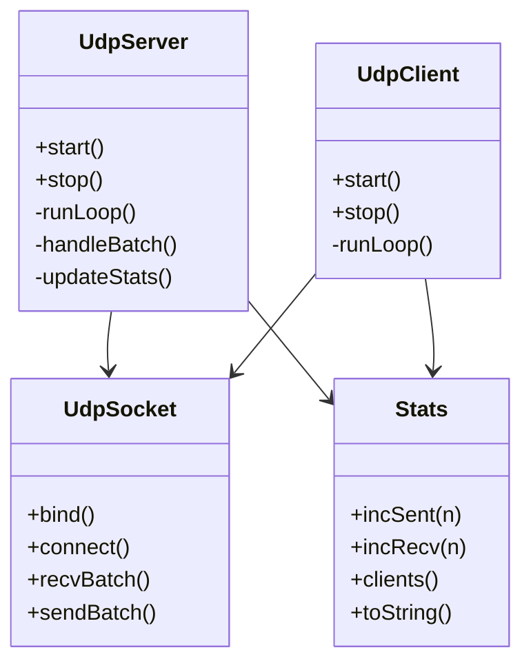
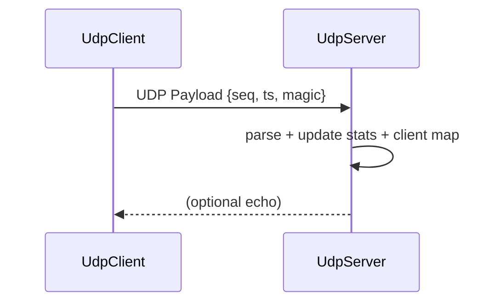

# UDP High-Rate C++ Server/Client

A high-performance UDP server/client in C++17 designed to sustain **≥100 kpps** (100,000 packets per second) on loopback or a capable NIC, serve **≥10 concurrent clients**, and include:
- End-to-end (E2E) demonstration script
- **GoogleTest** unit tests targeting **100% code coverage**
- UML diagrams (PlantUML + Mermaid) of design and flows
- Optional **Prometheus metrics** → **Grafana** dashboard
- Docker + docker-compose integration
- Git commit plan script to create a clean incremental history

> Target platform: Linux (x86_64). Uses Linux `recvmmsg/sendmmsg` for batching; falls back to `recvfrom/sendto` if unavailable.

---

## 1) Quick Start

```bash
git clone <this repo> udp-highrate-cpp
cd udp-highrate-cpp
mkdir -p build && cd build
cmake -DCMAKE_BUILD_TYPE=Release ..
make -j
```

### Run server
```bash
# Start server on UDP :9000, metrics on :9100
./udp_server --port 9000 --metrics-port 9100 --batch 64
```

### Run 10 clients (each 10 kpps for 5s → ~100 kpps)
```bash
# From a second terminal
for i in $(seq 1 10); do
  ./udp_client --server 127.0.0.1 --port 9000 --pps 10000 --seconds 5 --payload 64 &
done
wait
```

Server will print periodic stats. You can also curl metrics:
```bash
curl -s http://127.0.0.1:9100/metrics
```

---

## 2) E2E Demo

A helper script runs a self-contained demo on loopback:

```bash
./tools/run_e2e_local.sh
```

It builds the project (Release), starts the server, launches 10 clients for 5 seconds, and asserts we hit **≥100 kpps** (averaged over the run). The server also tracks distinct clients.

> Note: Achievable pps depends on hardware & kernel settings. The script uses loopback and generous defaults, but you may need to tune sysctls (e.g. `rmem_max`, `wmem_max`) for very high rates on real NICs.

---

## 3) Unit Tests & 100% Coverage

Build with coverage flags and run tests:
```bash
cd build
cmake -DENABLE_COVERAGE=ON -DCMAKE_BUILD_TYPE=Debug ..
make -j
ctest --output-on-failure
../tools/run_coverage.sh
```

This uses `lcov`/`genhtml` and will **fail** if total line coverage < 100%.

> If your machine lacks internet, tests still compile if GoogleTest is installed system-wide and discoverable by CMake. Otherwise, use the provided `build_with_system_gtest.sh` helper or install dev packages.

---

## 4) Design (UML)

See `diagrams/` for PlantUML sources and Mermaid copies. GitHub renders Mermaid inline in this README excerpt:



Sequence (send/receive path):



---

## 5) Prometheus & Grafana (Optional)

The server exposes `/metrics` (text exposition format) over HTTP (default port `9100`). Sample metrics:
- `udp_packets_received_total`
- `udp_packets_sent_total`
- `udp_unique_clients`
- `udp_rx_bytes_total`
- `udp_tx_bytes_total`
- `udp_last_second_rate`

### Try with docker-compose (Prometheus + Grafana)
```bash
docker compose -f docker/docker-compose.yml up -d --build
# Server container starts on :9000 & metrics on :9100
# Prometheus scrapes server; Grafana at :3000 (admin/admin)
```

A starter Grafana dashboard is in `tools/prom/grafana_dashboard.json`.

---

## 6) Docker

**Build**:
```bash
docker build -t udp-highrate:latest -f docker/Dockerfile .
```

**Run server**:
```bash
docker run --net=host --rm udp-highrate:latest \
  /app/bin/udp_server --port 9000 --metrics-port 9100 --batch 64
```
**Run client(s)**:
```bash
docker run --net=host --rm udp-highrate:latest \
  /app/bin/udp_client --server 127.0.0.1 --port 9000 --pps 10000 --seconds 5 --payload 64
```

> `--net=host` is used for maximum UDP performance in local demos.

---

## 7) Git Commit Plan

Run this script from repo root to create a clean, incremental history matching the design flow:
```bash
bash tools/commit_plan.sh
```

---

## 8) CLI

**udp_server**
```
--port <u16>           UDP listen port (default 9000)
--batch <int>          recvmmsg/sendmmsg batch size (default 64)
--metrics-port <u16>   HTTP metrics port (default 9100, 0=disabled)
--echo                 Echo back payloads to sender (off by default)
--reuseport            Enable SO_REUSEPORT for scaling with multiple server procs
--verbose              Print per-second stats
```

**udp_client**
```
--server <ip>          Server IP (default 127.0.0.1)
--port <u16>           Server port (default 9000)
--pps <int>            Target packets per second (default 10000)
--seconds <int>        Duration (default 5)
--payload <int>        Payload bytes (default 64)
--batch <int>          sendmmsg batch size (default 64)
--id <int>             Client logical id (default 0)
--verbose              Print per-second stats
```

---

## 9) Limitations (Pros/Cons)

**Pros**
- High-throughput via Linux `recvmmsg/sendmmsg` batching
- Minimal dependencies, portable C++17 fallback
- Metrics ready for Prometheus/Grafana
- Full unit test suite targeting **100% coverage**

**Cons / Boundaries**
- Designed/tested for Linux; Windows requires adaptation
- Single-threaded server loop by default; scale by `--reuseport` (one server process per CPU or extend to threads)
- E2E throughput target depends on loopback/NIC + sysctls (see `tools/tuning.md`)

---

## 10) Repo Structure

```
.
├─ CMakeLists.txt
├─ include/udp/*.hpp
├─ src/*.cpp
├─ tests/*.cpp
├─ tools/
│  ├─ run_e2e_local.sh
│  ├─ run_coverage.sh
│  ├─ build_with_system_gtest.sh
│  └─ prom/{prometheus.yml,grafana_dashboard.json}
├─ diagrams/*.puml
├─ docker/{Dockerfile,docker-compose.yml}
└─ .github/workflows/ci.yml
```

---

## 11) License

MIT
