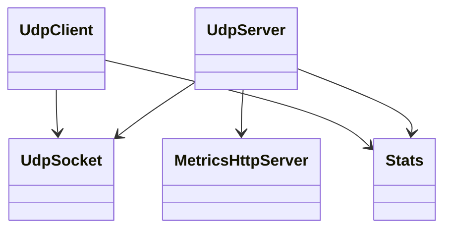
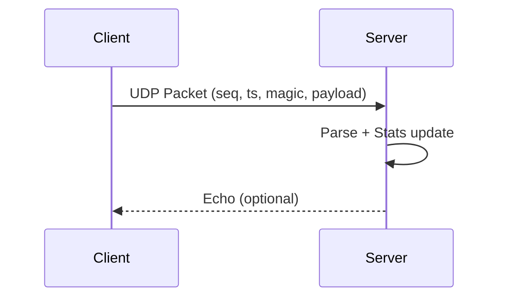

# Diagrams (Mermaid copies)

## Class

```mermaid
classDiagram
  class UdpServer
  class UdpClient
  class UdpSocket
  class MetricsHttpServer
  class Stats
  UdpServer --> UdpSocket
  UdpClient --> UdpSocket
  UdpServer --> Stats
  UdpClient --> Stats
  UdpServer --> MetricsHttpServer
```

## Sequence

```mermaid
sequenceDiagram
  participant C as Client
  participant S as Server
  C->>S: UDP Packet (seq, ts, magic, payload)
  S->>S: Parse + Stats update
  S-->>C: Echo (optional)
```
